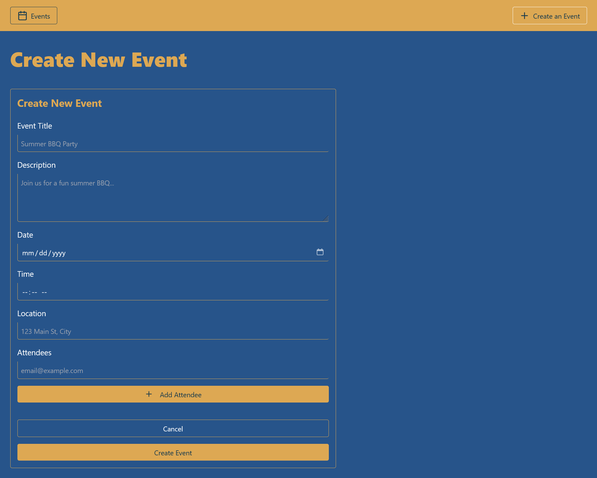
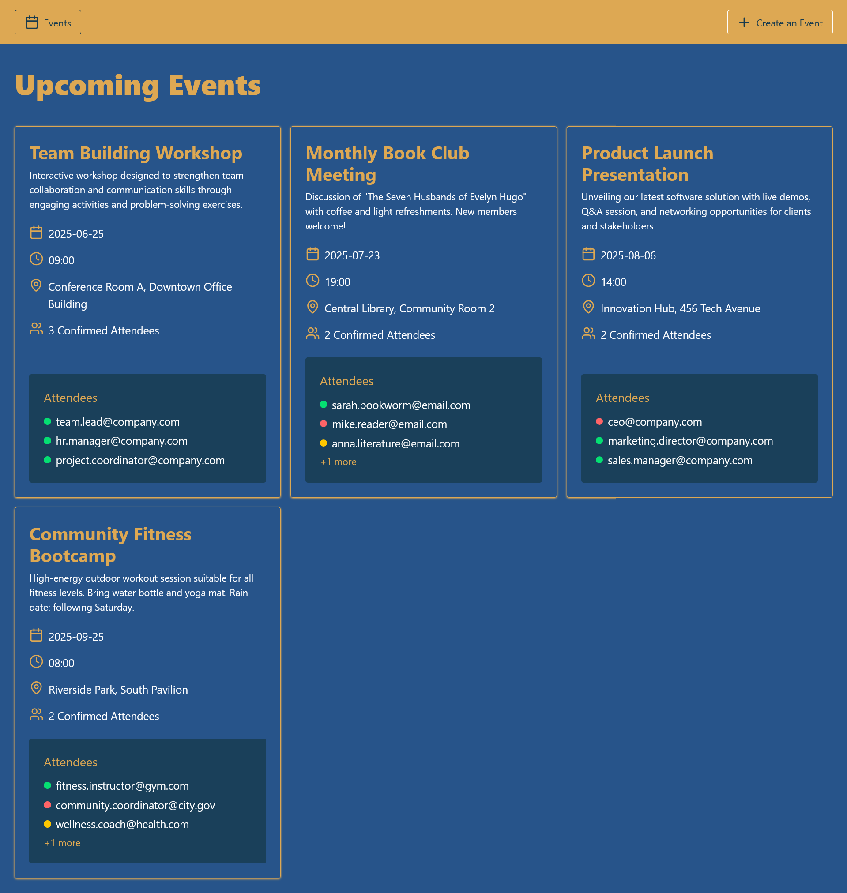
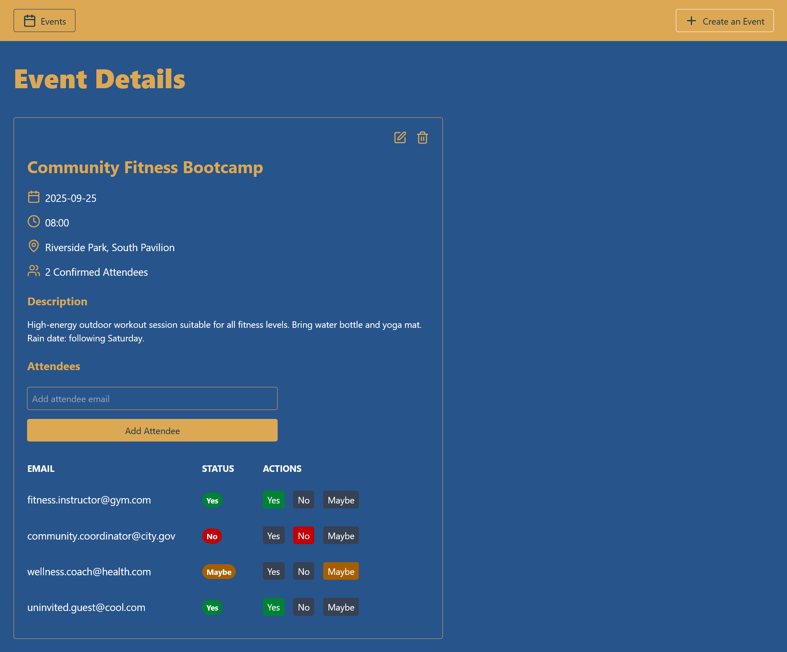
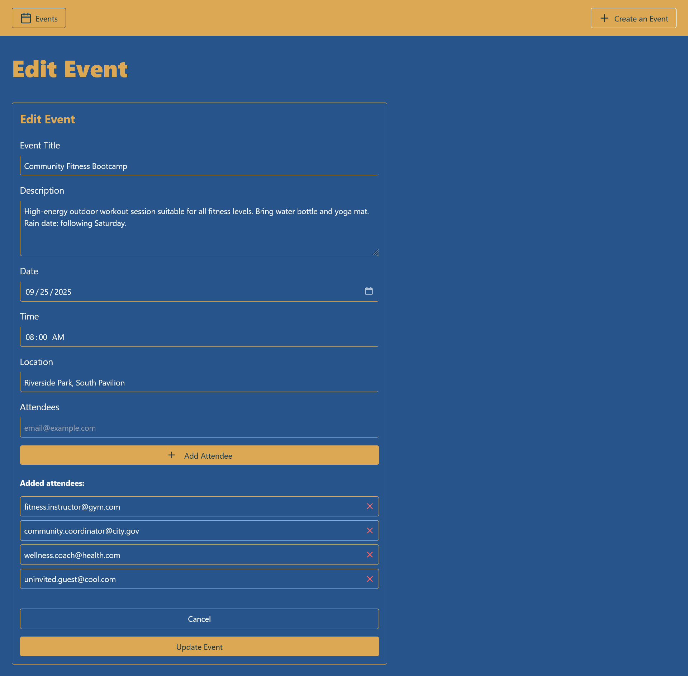

# Event Planner - React, TypeScript, Context API

This application is a comprehensive event management system built using React, TypeScript, Context API with useReducer, and Tailwind CSS. The primary focus of the app is to demonstrate modern React patterns for state management using Context API and useReducer hook. The use of TypeScript ensures type safety and better developer experience, while the Context API efficiently manages complex state transitions across event creation, editing, and attendee management.

## Create New Event

## 

## Upcoming Events Dashboard

## 

## Event Details Management

## 

## Edit Event Interface

## 

## Features

- **Event Management**:  
  Create, edit, and delete events with form validation and user-friendly interfaces.
- **Event Components**:
  - **Event Cards**: Display event title, date, time, location, and attendee count.
  - **Event Dashboard**: Organize and view all upcoming events in a clean grid layout.
  - **Event Details**: View full event information with attendee management capabilities.
  - **RSVP System**: Track attendee responses with Yes/No/Maybe status indicators.
- **Attendee Management**: Add, remove, and manage event attendees with real-time status updates.
- **State Management**: Centralized state management using React Context API and useReducer.
- **Responsive Design**: Styled with Tailwind CSS for consistent UI across all devices.

## Learning Objectives

- Implement comprehensive **CRUD operations** in a **React** and **TypeScript** application.
- Master **Context API** and **useReducer** for complex state management without external libraries.
- Style components dynamically using **Tailwind CSS** utility classes with modern design patterns.
- Practice **component composition** and **separation of concerns** in a React app.
- Build a **fully typed application** with TypeScript for improved development experience.
- Implement **conditional rendering** and **state-dependent UI updates**.

## Taking a Look at the Completed Project

To set up the project after forking or downloading it from GitHub, follow these steps:

1. Open with your favorite code editor

2. Install the required dependencies by running the following command:

```
npm install
```

3. Start the development server by running the following command:

```
npm run dev
```

Happy Coding and Learning 😊
